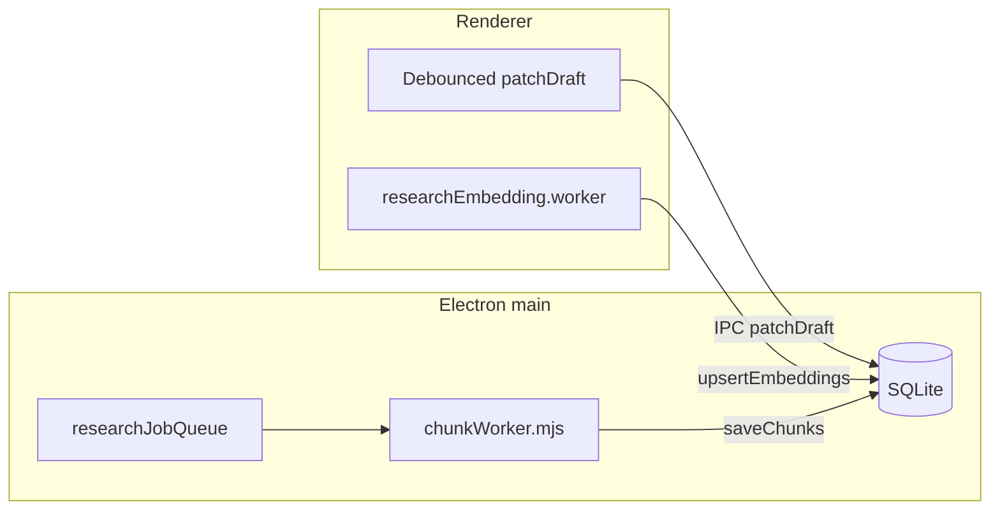

# Desktop persistence and execution architecture

OpenBenTT research projects use a **desktop-first** storage and job model in the Electron shell. The web build keeps a smaller localStorage fallback with the same debounced draft behavior.

## What was replaced

| Before | After |
|--------|--------|
| Monolithic `project.json` per project (papers, draft, chunks, embeddings inline) | SQLite `userData/research-projects/research.db` with normalized tables |
| `localStorage` full project blobs on desktop | SQLite + `localStorage` index removed on desktop (active project id in `app_state`) |
| Every keystroke → `buildCorpusChunks` + full `saveProject` IPC | Debounced `patchDraft` (800ms) — draft row only |
| `chunkEmbeddings` inside JSON | `embeddings` table (Float32 BLOB, 384-dim MiniLM) |
| Main-thread embedding loop | `researchEmbedding.worker.ts` Web Worker |
| Synchronous chunk rebuild on draft edit | Background `rechunk` job via `worker_threads` (`chunkWorker.mjs`) |

## Storage layout

```
userData/research-projects/
  research.db              # SQLite (WAL), schema v3
  research.db.bak          # Automatic backup before writes
  {projectId}/
    papers/{paperId}.pdf   # Binary PDFs (unchanged)
    exports/               # JSONL exports
    project.json.legacy    # Migrated monolithic files (renamed, not deleted)
```

### SQLite tables (schema v3)

- `projects` — metadata, revisions, attributions
- `drafts` — LaTeX source (hot path for autosave)
- `bibliography` — BibTeX string
- `papers` — metadata + extracted text (not in JSON blob)
- `corpus_chunks` — TF–IDF / similarity chunks
- `embeddings` — persistent vectors (`chunk_id`, BLOB)
- `draft_history` — undo restore points
- `project_snapshots` — full project JSON backups (max 20 per project)
- `research_jobs` — queue audit trail
- `app_state` — active project id

### Migrations and recovery

- Versioned migrations in `electron/researchDb.mjs` (`migrateV1`–`V3`)
- Legacy `project.json` imported on startup (`initResearchStorage`)
- DB open failure → restore from `research.db.bak`
- `createSnapshot` before legacy import (`pre-migration`)

## Job queue and workers



| Job type | Where it runs | Purpose |
|----------|---------------|---------|
| `rechunk` | Main `worker_threads` | Rebuild `corpus_chunks` after library changes |
| `build-embeddings` | Renderer Web Worker | MiniLM index (UI stays responsive) |
| PDF parse | Renderer pdf.js worker | Unchanged |

IPC: `research:enqueueJob`, `research:cancelJob`, `research:jobProgress` events.

## Autosave and draft UX

- `createDraftAutosave` — 800ms debounce, statuses: `idle | dirty | saving | saved | error`
- `DraftSaveStatus` in Notebook shell
- In-memory undo/redo (`draftHistory.ts`); desktop can also `pushDraftHistory` via IPC
- `setDraftTex` no longer calls `buildCorpusChunks` or `saveResearchProject`

## Large projects

- Papers and text in separate rows (not one JSON write per keystroke)
- Embeddings stored as binary blobs (incremental `upsertEmbeddings`)
- PDFs on disk; optional path-based copy IPC (`storePaperPdfPath`)
- Snapshots + WAL for crash recovery
- `before-quit` → `shutdownResearchServices()` flushes jobs and closes DB

## Tests

- `src/lib/research/draftAutosave.test.ts` — debounce proves no flush per keystroke
- `electron/researchDb.test.mjs` — `patchDraft` preserves chunks; snapshot restore
- `src/lib/research/draftHistory.test.ts` — undo/redo

Run: `npm run test:unit` and `node --test electron/researchDb.test.mjs`

## Intentionally deferred

- DuckDB analytics layer for corpus statistics
- Full HNSW / sqlite-vec ANN (current store: brute-force cosine on loaded vectors)
- Main-process MiniLM (embeddings stay renderer worker + IPC persist)
- Chat thread history in SQLite (still app chat `localStorage`)
- Cross-project embedding cache
- Automatic periodic snapshots (manual + pre-migration only; easy to add timer in main)
