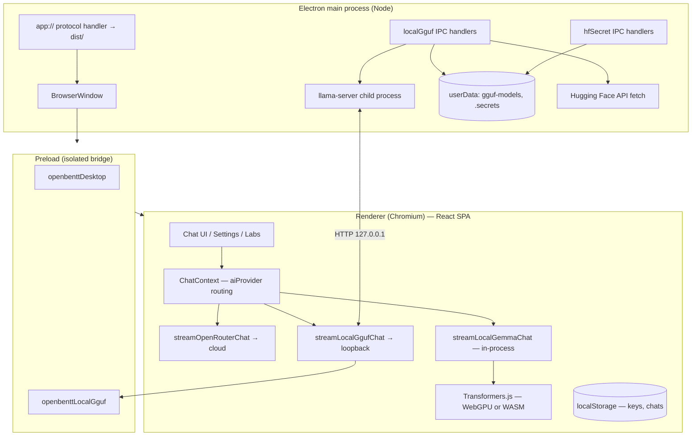

# Openbentt — Desktop App System Design

**Scope:** Electron desktop shell only (`electron/` + how `src/` uses it).  
**Product:** Openbentt — local-first chat client (OpenRouter, on-device models, workspaces).

---

## 1. Problem this desktop build solves

| Need | How the desktop app addresses it |
|------|----------------------------------|
| **Privacy / air-gapped use** | Run **on-device** models (browser Transformers.js / WebGPU **or** native **GGUF** via `llama-server`) without sending prompts to cloud APIs. |
| **Same UX as web** | One React/Vite codebase; Electron only wraps it — no forked UI logic. |
| **GGUF without a separate stack** | Main process can **download** `.gguf` from Hugging Face, **spawn** `llama-server` on `127.0.0.1`, and the renderer talks **OpenAI-compatible** `chat/completions` locally. |
| **Stable WebGPU on Linux** | Main process sets Chromium flags (`enable-unsafe-webgpu`, optional Ozone/X11 handling) **before** `app.ready`, which the normal browser cannot assume. |
| **Secrets for gated HF models** | **Electron `safeStorage`** (+ restricted fallback file) stores Hugging Face token for downloads; token is not baked into the web bundle. |

---

## 2. High-level architecture (Mermaid)



---

## 3. How pieces are supposed to work

### 3.1 Shell and loading the UI

- **Development:** `OPENBENTT_ELECTRON_DEV=1` → window loads `http://localhost:8080/chat` (Vite must be running).
- **Packaged:** Custom **`app://`** scheme serves files from `dist/` with SPA fallback to `index.html`, so React Router paths like `/chat` work without a static host.

Security defaults: **context isolation**, **no Node in renderer**, **sandboxed** preload.

### 3.2 AI provider routing (renderer)

The React app selects a provider (`openrouter`, `webgpu_gemma`, `local_gguf`, plus OpenAI-compatible URL mode). For the desktop-relevant paths:

- **`webgpu_gemma`:** `@huggingface/transformers` loads model weights (from Hugging Face repos) inside the **renderer**. Inference uses **WebGPU** when available, with dtype/backends cascade; can fall back to **WASM/CPU** and smaller models.
- **`local_gguf`:** Only if `window.openbenttLocalGguf` exists (Electron). Renderer calls `ensureServer` via IPC; main process starts **`llama-server -m <gguf> --host 127.0.0.1 --port <dynamic>`**. Chat then reuses the same streaming client as OpenRouter but pointed at `http://127.0.0.1:<port>/v1/chat/completions`.
- **`openrouter`:** Direct HTTPS to OpenRouter from the renderer (same as web); API keys stay in **localStorage** client-side.

### 3.3 Local GGUF subsystem (main + preload)

- **Registry:** JSON under `userData/gguf-models/registry.json`; files under `userData/gguf-models/files/`.
- **Download:** Main process streams from Hugging Face; optional **Bearer** token from IPC payload or **`readHfTokenMaybe`** (encrypted store).
- **Progress:** Main sends `localGguf:downloadProgress` to the focused window webContents.
- **Binary resolution order:** `OPENBENTT_LLAMA_SERVER_PATH` → Settings path → **packaged** `resources/llama/<platform>/` → `which` / `where` on PATH.
- **Lifecycle:** On app quit, **`cleanupLocalGgufOnQuit`** terminates `llama-server`.

### 3.4 WebGPU / GPU stability (main-only switches)

Linux Wayland vs Vulkan issues and blocklisted adapters are handled with **`app.commandLine.appendSwitch`** early in `main.mjs`. Escape hatches: `OPENBENTT_DISABLE_WEBGPU_FLAGS`, `OPENBENTT_DISABLE_GPU`, `OPENBENTT_OZONE_PLATFORM`, etc.

---

## 4. Local models — two distinct runtimes

| Aspect | **WebGPU / WASM (“Gemma” path)** | **Local GGUF (`llama-server`)** |
|--------|----------------------------------|----------------------------------|
| **Where it runs** | Renderer process (Chromium + JS/WASM/WebGPU). | **Child process** — native `llama-server` binary. |
| **Weights** | Downloaded/cached by Transformers.js from HF repos; **not** the same as `.gguf` registry. | User-selected **`.gguf`** on disk (HF download or manual). |
| **Compute** | GPU via WebGPU or CPU via WASM. | Native llama.cpp backends (CPU/CUDA/Metal/Vulkan depending on build). |
| **Protocol** | In-process function calls / streaming chunks. | **HTTP** OpenAI-compatible API on localhost. |
| **Desktop dependency** | Needs Chromium flags for WebGPU on some Linux setups. | Needs a working **`llama-server`** binary (bundled optional — see `resources/llama/README.txt`). |

---

## 5. Distribution plan (as implemented + gaps)

**CI / releases (from `RELEASING.md` and `package.json`):**

- **Tag** `v*` → GitHub Actions **`release.yml`** builds in parallel:
  - **Linux:** `.AppImage`, `.deb` (+ optional web dist zip).
  - **Windows:** NSIS **`.exe`** (+ zip).
  - **macOS:** **`.dmg`**, **`.zip`**.
- Artifacts publish to a **single GitHub Release**.
- **Signing:** Currently oriented toward **unsigned** installers unless you add Apple/Microsoft certificates and workflow secrets.

**electron-builder packaging:**

- Ships **`dist/`**, **`electron/`**, `package.json`; **excludes** `node_modules` from the asar (runtime uses Electron’s module resolution for the main process as configured).
- **BusyTeX** assets are part of the web build pipeline for LaTeX-related workspaces (see release workflow).

**Operational notes for distributors:**

1. **llama-server** is **not** automatically in every CI artifact unless you add **`extraResources`** (or equivalent) pointing at built `resources/llama/<platform>` binaries; today the app **falls back to PATH** or user-configured path (`electron/localGgufService.mjs`).
2. macOS **Gatekeeper** and Windows **SmartScreen** may warn on unsigned builds — plan **signing + notarization (macOS)** for low-friction installs.
3. Consider **auto-update** (`electron-updater`) if you want a consumer-style update channel (not present in-tree by default).

---

## 6. Suggested improvements (desktop-focused)

1. **Ship `llama-server` in release artifacts** via `electron-builder` `extraResources` for each platform to reduce “binary not found” support burden.
2. **Code signing + notarization** (macOS) and **Authenticode** (Windows) for releases.
3. **Structured IPC validation** (e.g. zod) on all `localGguf:*` payloads to prevent accidental misuse.
4. **Resource caps / UX** for parallel downloads and model size warnings (partially present via disk free check).
5. **Single-instance** lock and “open URL” deep link if you want OS integration.
6. **Crash telemetry** (opt-in) distinct from chat content.
7. **Electron auto-update** channel + staged rollouts.
8. **Wayland-native** path when Chromium/Vulkan/WebGPU stack stabilizes; keep current X11 default as compatibility mode.

---

## 7. Simple layered view (ASCII)

```
┌─────────────────────────────────────────────────────────────┐
│                    Electron Main Process                     │
│  app://  ·  window  ·  IPC  ·  spawn llama-server  ·  HF DL │
└───────────────────────────┬─────────────────────────────────┘
                            │ contextBridge (preload.cjs)
┌───────────────────────────▼─────────────────────────────────┐
│              Renderer — React / Vite / React Router          │
│  ChatContext → openrouter | webgpu_gemma | local_gguf        │
└──────────────┬───────────────────────────┬──────────────────┘
               │                           │
        WebGPU / WASM                HTTP 127.0.0.1
        Transformers.js              (OpenAI-compatible)
```

---

## 8. Generating the PDF

A print-optimized HTML copy lives beside this file: `docs/desktop-system-design-print.html`. Generate PDF locally:

```bash
chromium --headless --disable-gpu \
  --print-to-pdf=docs/desktop-system-design.pdf \
  "file://$(pwd)/docs/desktop-system-design-print.html"
```

(Use `google-chrome` instead of `chromium` if needed.)

---

*Document generated from repository analysis; version aligns with Openbentt desktop sources under `electron/` and `src/`.*
